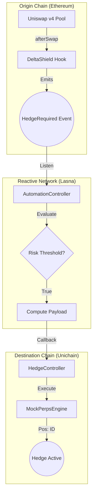

# DeltaShield Knowledge Base & Theory

Welcome to the DeltaShield Documentation. This directory contains the theoretical foundation, mathematical derivations, and architectural specifications of the DeltaShield protocol.

## Documentation Map

Navigate the technical specifications using the following guide:

| Document | Primary Focus | Best For... |
| :--- | :--- | :--- |
| [Overview.md](./Overview.md) | High-level Vision | Understanding the "Why" and Impermanent Loss. |
| [Architecture.md](./Architecture.md) | System Design | Understanding the three-layer stack. |
| [Delta.md](./Delta.md) | **Core Mathematics** | Deep dive into concentrated liquidity calculus. |
| [Workflow.md](./Workflow.md) | Data Flow | Step-by-step trace of a hedge trigger. |
| [Hook.md](./Hook.md) | AMM Sensing | Uniswap v4 implementation details. |
| [Automation.md](./Automation.md) | Reactive Logic | RVM monitor and trigger engine specs. |
| [Hedge.md](./Hedge.md) | Execution Layer | Derivative strategies and mock perps engine. |
| [Security.md](./Security.md) | Risk & Safety | Threat modeling and gas optimizations. |

---

## 🏗️ System Architecture

DeltaShield implements a **Synchronous Sensation + Asynchronous Execution** loop.

---

## 📐 The Mathematics of Delta Neutrality

The core breakthrough of DeltaShield is the simplification of high-order calculus into efficient on-chain logic.

### 1. The Portfolio Value $(\huge V)$
For a concentrated liquidity position with liquidity $\huge L$ between prices $\huge P_a$ and $\huge P_b$:

$$\huge V = L \left(2\sqrt{P} - \sqrt{P_a} - \frac{P}{\sqrt{P_b}}\right)$$

### 2. The Delta $(\huge \Delta)$
Delta is the sensitivity of value to price changes $(\huge \Delta = \frac{dV}{dP})$. Taking the derivative:

$$\huge \Delta = L \left(\frac{1}{\sqrt{P}} - \frac{1}{\sqrt{P_b}}\right)$$

### 3. The Implementation Shortcut
Notice that the equation for Delta is identical to the equation for **Token0 Inventory** $(\huge x)$ in Uniswap v3/v4:

$$\huge \Delta \equiv x$$

**Conclusion**: To hedge an LP position, the system simply needs to hold a short position equal to the current amount of Token0 held by the LP.

---

## 🔢 Numerical Example

**Scenario**: An LP provides liquidity to an ETH/USDC pool.

*   **Range**: $1500 - $2500 ($\sqrt{P_a} \approx 38.73, \sqrt{P_b} \approx 50$)
*   **Current Price**: $2000 ($\sqrt{P} \approx 44.72$)
*   **Liquidity ($L$)**: 1000

### Step 1: Compute Exposure
$$\huge \Delta = 1000 \times \left(\frac{1}{44.72} - \frac{1}{50}\right) \approx 2.36\ ETH$$

### Step 2: Establish Hedge
The **Automation Layer** detects this $+2.36\ ETH$ exposure and instructs the **Hedge Layer** to open:
*   **Position**: `-2.36 ETH` (Short)

### Step 3: Price Movement Result
If ETH price rises to **$2100**:
1.  **LP Position**: Value increases by approx $\huge 2.36 \times \$100 = +\$236$.
2.  **Hedge Position**: Value decreases by $\huge 2.36 \times \$100 = -\$236$.
3.  **Net Result**: **$0 change in principal.** The LP successfully captures the **Trading Fees** without the price risk.

---

## 🔄 System Workflow

1.  **Sensing**: `AMMHook` observes `slot0` changes.
2.  **Filtering**: Hook checks if `abs(delta) > threshold` and `cooldown` is met.
3.  **Signaling**: Hook emits `HedgeRequired`.
4.  **Relaying**: Reactive Network picks up the event logs on Ethereum.
5.  **Analyzing**: RVM validates the emitter and computes the necessary `targetSize`.
6.  **Executing**: RVM sends a cross-chain callback to the `HedgeController`.
7.  **Accounting**: `MockPerpsEngine` logs the new position and calculates p/l relative to the entry price.
